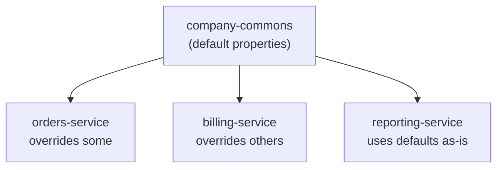
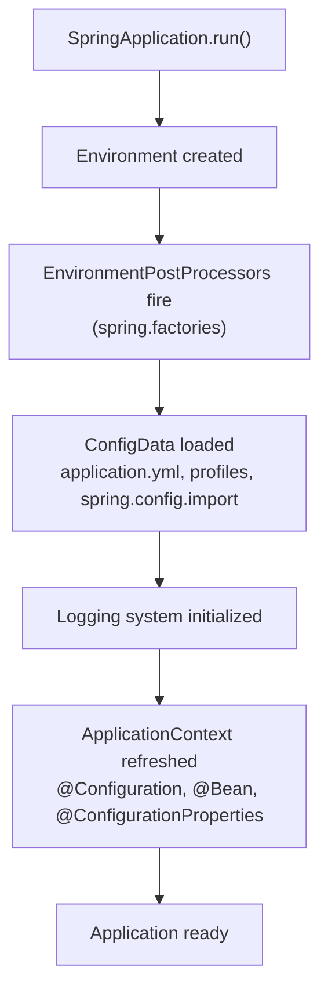

# Spring Boot's Quiet Hook for Shipping Configuration: EnvironmentPostProcessor

Hi everyone! This is Mikhail Polivakha, technical lead of the [Axelix project](https://github.com/axelixlabs/axelix) (an Open Source product that helps you find common problems and inefficiencies in Spring Boot applications — btw, give us a star!).

I want to talk about a piece of Spring Boot that a lot of people have never touched directly, yet almost everyone has bumped into the problem it solves. Let me start with a scene that I suspect will feel familiar:

Let's imagine the following scenario. You maintain a shared library, an internal "company-commons" starter that every service depends on. And you want it to set a few sensible defaults for all the apps that include this Spring Boot starter.

So you drop an `application.yml` into the library's `src/main/resources`, set your properties there, ship it, and unfortunately the behavior is not at all what you expected. If you have ever had problems similar to this one - then this article is for you.

**The TL;DR is:** `application.yml` is the wrong tool for that job, and Spring Boot has a purpose-built hook for it that rarely makes it into tutorials - `EnvironmentPostProcessor` (At Axelix, we use it extensively btw).

If you're interesting in the particular details, then lets dive in!

## The Problem Everyone Eventually Meets

Here is the simplified setup. You have many services. They all depend on one shared module, call it `company-commons`. You want that module to contribute default configuration to every service that includes it:

- a sensible Jackson setup
- a default actuator exposure
- a connection-pool size
- a logging format

I hope you get the idea. Anything that would otherwise be copy-pasted into forty different `application.yml` files.

But (and this is the whole point) **each service must still be able to override any of those defaults in its own configuration.** The library provides the common floor, not the ceiling.



So the requirement is deceptively simple:

> Ship default properties from a library, applied automatically, that any individual service can still override.

Now let's watch the obvious solutions quietly fail this requirement one by one.

## Why the Approaches Everyone Reaches For Disappoint

### Attempt 1: A bundled `application.yml` inside the library

This is the first thing everyone tries. You put an `application.yml` inside `company-commons`, and now there are **two** `application.yml` files on the classpath: the library's and the service's.

Here's the catch: Spring Boot does not "merge" two `application.yml` files that live at the same conventional location. It resolves configuration data from well-known locations, and a second `application.yml` sitting somewhere else on the classpath does not participate in that resolution the way you imagine. Depending on classpath ordering and packaging, your library's file may be silently ignored, or it may behave in ways that feel arbitrary. Either way, the starter's `application.yaml` will not serve as a default
but rather the behavior will be quite unpredictable, and it is certainly not the good solution.

### Attempt 2: Ship `application-commons.yml` and tell teams to activate a profile

Cleaner, right? Put the defaults under a profile and document:

> Just add `commons` to your `spring.profiles.active` and you're all set.

The problem is right there in the word _"just"_. Now the correctness of your defaults depends on **every team, in every service, forever, remembering to activate that profile.** Miss it in one service and the defaults silently vanish,
which may lead to incidents or security risks, depending on the nature of the custom starter.

So we want the platform **to enforce the behavior**, not a sentence buried in a README.

### Attempt 3: A `@Configuration` class with `@PropertySource` / `@Bean`

Now we're writing actual code, so surely we have full control. Not quite, since this time the problem is *timing*.

A `@Configuration` class is processed while the `ApplicationContext` is being built. But a lot of important configuration is consumed **before** that point:

- the logging system is initialized very early;
- Spring Boot's own config-data machinery (the thing that loads `application.yml`, resolves profiles, handles `spring.config.import`) has already run in `ConfigDataEnvironmentPostProcessor`;
- property precedence for `@PropertySource` is _awkward_. What do I mean? Well, it is awkward in the sense that overall controlling the ordering of property sources via `@PropertySource` is generally a bad and unpredictable idea.

So a bean-based approach can *read* configuration, **but it is, in general, far too late to shape the foundation of it**.

If your default needs to influence logging, or config-data location, or anything resolved during startup, a `@Bean` never gets a word in.

### Attempt 4: Just document the properties

> "Add these five properties to your `application.yml`."

This is Attempt 2 without even the profile. It fully offloads the work, and whats worse - *the risk of getting it wrong*, onto *every single consuming team*. It's not a good solution at all.

P.S: I must acknowledge the small embarrassment since [we used to ask for it in Axelix 1.1 release](https://axelix.io/docs/start/configuring-spring-boot-starter#exposing-the-endpoints-on-axelix-below-120), but since Axelix 1.2 we no longer would require that (thanks to the external OSS contributor btw!)

### Micro-conclusion

Every naive approach fails one of three ways: it either runs at the wrong time, or it lands at the wrong precedence, or it depends on a humans doing something. What we actually want is a hook that:

1. runs **early**, while the `Environment` is still being assembled.
2. lets us add a property source at a **precedence we choose**. Underneath the user's config for defaults, or on top **when we deliberately want to win regardless**.
3. is **automatic** (which was important for Axelix) - no profile to activate, no property to remember.

Fortunately, that hook exists. It's called `EnvironmentPostProcessor`.

## The Nature of `EnvironmentPostProcessor`

Spring Framework has an object of type `ConfigurableEnvironment`. This is the object that holds all your property sources, profiles, and resolved properties early in startup - **before** (which is important) the `ApplicationContext` is refreshed.

So an `EnvironmentPostProcessor` is a callback that **fires during that window** (i.e. before refresh) and gets handed the `Environment` to mutate:

```java
public class CompanyDefaultsEnvironmentPostProcessor implements EnvironmentPostProcessor {

    @Override
    public void postProcessEnvironment(ConfigurableEnvironment environment, SpringApplication application) {
        environment
                .getPropertySources()
                .addLast(new MapPropertySource("company-defaults", Map.of(
                        // override the actuator's default
                        "management.endpoints.web.exposure.include", "health,info",
                        // override the jackson's default
                        "spring.jackson.default-property-inclusion", "non_null"
                )));
    }
}
```

There're a couple of things wroth noting:

- **`addLast(...)`** puts our property source at the **end** of the resolution order, i.e. the **lowest** precedence. Every other source: the service's `application.yml`, environment variables, command-line arguments - all of them are consulted first. Our values only apply when nobody else set them. That is precisely **"the defaults"** behavior.
- It runs early enough that these properties are in place before the necessary beans are bootstrapped, and before most of what Spring Boot does with the `Environment`.

### How Does Spring Even Find Our `EnvironmentPostProcessor`?

There is an important thing to realize that an `EnvironmentPostProcessor` just **cannot be a simple Spring bean.** Just think about it - it must run **before** the `ApplicationContext` exists, so there is no bean container to look it up in yet. This is a classic chicken-and-egg problem.

But the good news are that this problem is quite well known in Spring Boot, and it is already solved with `spring.factories` (and no, this file is NOT used for `@AutoConfiguration` classes anymore).

So, we need to register our `EnvironmentPostProcessor` in `META-INF/spring.factories` (just a simple key value pair):

```properties
org.springframework.boot.EnvironmentPostProcessor=\
com.acme.commons.CompanyDefaultsEnvironmentPostProcessor
```

Spring Boot discovers these via `SpringFactoriesLoader`, which is the same mechanism behind a lot of its early bootstrapping. Again, note that this is `spring.factories` and **not** the newer `AutoConfiguration.imports` file used for auto-configuration classes. Those are different.

> P.S: Just a small post-review catch here. In Spring Boot 4 the interface moved from `org.springframework.boot.env.EnvironmentPostProcessor` to `org.springframework.boot.EnvironmentPostProcessor`. If you support multiple Boot generations, mind the package.

### Where it sits in startup



The exact interleaving of the steps in the middle generally depends on the ordering, which, as we're about to see, is the genuinely subtle part.

## A Real Example: How We Exposes Custom Actuator Endpoints

Let me show you a real, in-production use of exactly this pattern. Axelix ships Spring Boot starters that teams add to their services. A starter is, effectively, just a library that must contribute some configuration to someone else's application - the exact shape of the problem above.

Whats important is that Axelix defines its own actuator endpoints (that's how Axelix Master talks to your service). For those endpoints to be reachable, they have to be listed in `management.endpoints.web.exposure.include`. We *could* write in the docs "please add `axelix-*` to your exposure list" - and in the 1.1 days we did exactly that (I am sorry 🙈). But you already know how I feel about solutions that depend on people remembering.

So, since 1.2, the starter will contribute the endpoints itself, via an `EnvironmentPostProcessor`. The twist is that `management.endpoints.web.exposure.include` is a property the user very likely **already set**. So we must add our endpoints to end-user's, we **must NOT** overwrite them. Here is the [actual code](https://github.com/axelixlabs/axelix/blob/master/sbs/axelix-spring-boot-3-starter/src/main/java/com/axelixlabs/axelix/sbs/spring/core/env/AxelixEndpointsEnvironmentPostProcessor.java) (lightly trimmed):

```java
public class AxelixEndpointsEnvironmentPostProcessor implements EnvironmentPostProcessor, Ordered {

    public static final String INCLUDED_PROPERTY = "management.endpoints.web.exposure.include";

    @Override
    public void postProcessEnvironment(ConfigurableEnvironment environment, SpringApplication application) {
        Set<String> current = Binder.get(environment)
                .bind(INCLUDED_PROPERTY, Bindable.setOf(String.class))
                .orElse(Collections.emptySet());

        if (current.contains("*")) {
            return; // the user already exposed everything, nothing to do
        }

        Set<String> merged = new LinkedHashSet<>();
        if (current.isEmpty()) {
            merged.add("health"); // preserve Spring Boot's own default, which we'd otherwise shadow
        }
        current.forEach(merged::add);
        merged.addAll(discoverAxelixEndpointIds(environment)); // classpath scan for @Endpoint

        environment
                .getPropertySources()
                .addFirst(new MapPropertySource("axelix", Map.of(INCLUDED_PROPERTY, String.join(",", merged))));
    }

    @Override
    public int getOrder() {
        return ConfigDataEnvironmentPostProcessor.ORDER + 1;
    }
}
```

A few things here are worth calling out:

- We use `Binder` to **read the user's existing value first**, honoring whatever they configured, and we bail out entirely if they already exposed `*`.
- We **merge** their endpoints with ours instead of replacing them.

So, simple as that.

### The Subtle Part: Ordering

Remember I teased that ordering is the genuinely subtle bit? Here it is. Look at `getOrder()`:

```java
return ConfigDataEnvironmentPostProcessor.ORDER + 1;
```

We deliberately run **just after** `ConfigDataEnvironmentPostProcessor`, the built-in processor that loads `application.yml`, resolves profiles, and handles `spring.config.import`.

Why? Because we need to *read* the user's `management.endpoints.web.exposure.include`, and that value most likely lives in their `application.yml`. If we ran **before** config data was loaded, that property simply "wouldn't be there yet", and we'd merge against an empty set, silently dropping the user's configuration.

That's the rule of thumb worth taking away:

> An `EnvironmentPostProcessor` that **reads** existing configuration must run **after** config data is loaded. One that **bootstraps where configuration comes from (e.g. new YAML file)**, must run **before** it.

## Gotchas Worth Knowing Before You Reach for It

`EnvironmentPostProcessor` is powerful precisely because it runs so early, and that earliness is also the dually-edged sword:

- **No dependency injection.** Again, it's not a bean, so you can't `@Autowired` anything into it. Keep it self-contained.
- **No logging (yet).** The logging system may not be initialized when your processor runs, so logging from inside one is unreliable, although, Spring Boot gives you a `DeferredLogFactory` to buffer output until logging is ready, if you truly need it.
- **Fail gracefully.** An exception here can derail the whole startup, very early, with poor diagnostics. If your logic can fail (a classpath scan, some parsing), guard it.
- **It's global.** It fires for *every* application that has your library on the classpath. That's the feature, but it also means you should keep the work conditional and cheap, and bail out early when there's nothing to do (as the example above does with the `*` check).
- **Prefer `Binder` over hand-parsing** when reading structured or relaxed-binding properties (sets, lists, `kebab-case` vs `camelCase`). It's what Spring Boot itself uses.

## When to Reach for It, and When Not

Use an `EnvironmentPostProcessor` when:

1. You are shipping configuration *from a library* into someone else's application, and it should apply automatically.
2. The configuration must be in place **early** - before beans, before logging, or before/around config-data resolution.
3. You need to *derive*, *merge*, or *scan* to compute the values, rather than state them statically.
4. You want defaults that stay overridable (`addLast`), or deliberately win after merging with the user's input (`addFirst`).

Reach for something simpler when:

- If you just need static defaults for **your own** application (not a library). A plain `application.yml` in that application is completely fine.
- The configuration is either only consumed *after* the context is up. Ordinary `@ConfigurationProperties` and beans are simpler and more discoverable.
- You'd be tempted to hide an important parameter here that really belongs in an explicit API or a property the user sets on purpose.
- You provide defaults for your own properties, not for Spring Boot's properties. For your own `@ConfigurationProperties`, the `EnvironmentPostProcessor` is typically an overcomplication.

## Closing Thoughts

The example above is open source, so [go read the real thing in the repository](https://github.com/axelixlabs/axelix) if you'd like to see how the pieces fit together.

Take care!