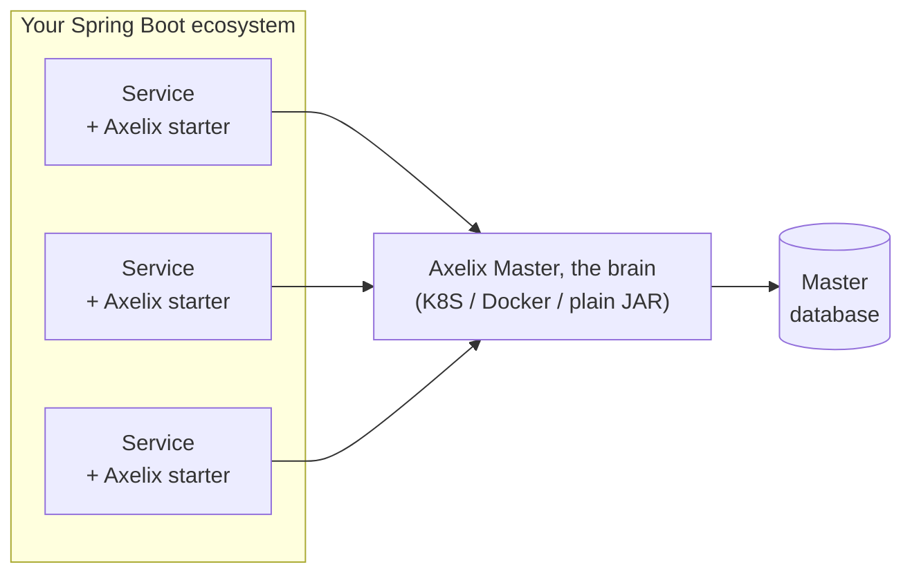
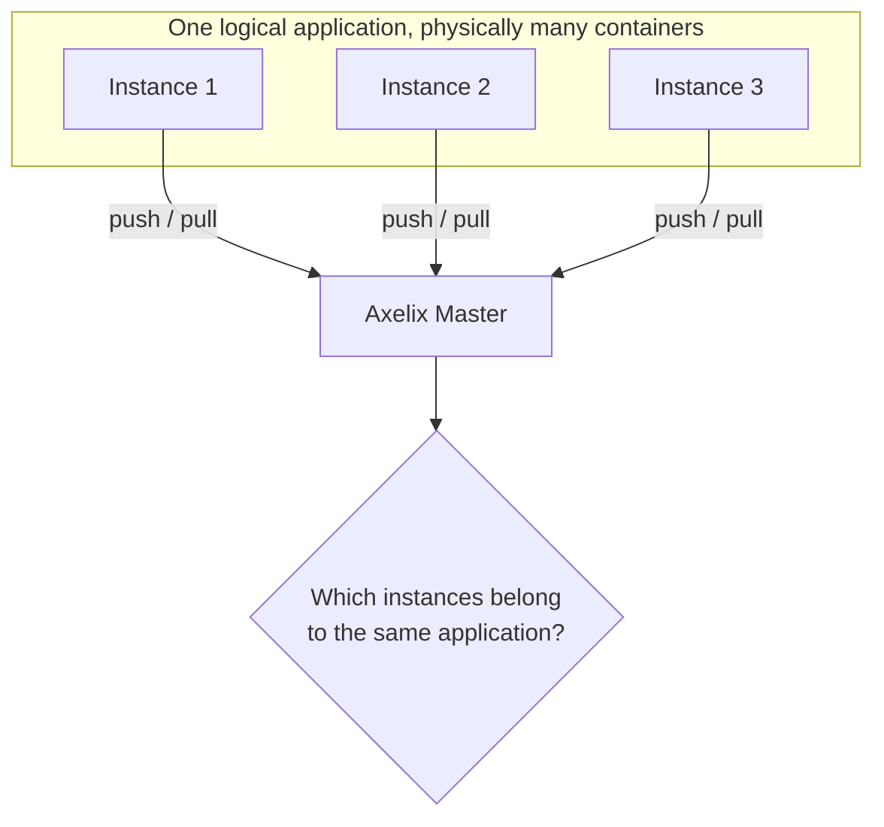
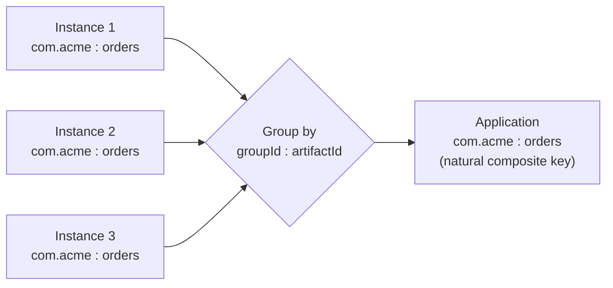

Hi everyone! This is Mikhail Polivakha, tech lead of the [Axelix project](https://github.com/axelixlabs/axelix) (btw, give us a star!). In my experience consulting teams that build enterprise applications, I keep getting asked:

> What about natural keys in the database? Say I have a column that lets me explicitly identify a record, should I use it as the Primary Key?

And over my years of designing enterprise systems, and over the time spent designing [Axelix](https://github.com/axelixlabs/axelix), I've come to a conclusion: **just never use natural keys, ever.** When you feel the urge to do it, step outside, take a walk, get some fresh air, and it'll pass.

I understand this answer is categorical, so I'll add a couple of clarifications about what to do if you do happen to have a unique discriminating column that, _as it seems to you_, lets you uniquely identify a record in a database table. The full, nuanced answer is of course more complicated, but if I have to give you a straight TL;DR:

> When designing new systems, in my opinion, you should **always** use surrogate primary keys.

Now let's get into why I think so.

## Rules Written in Blood

Rules like the one above are usually born out of getting burned on real projects several times. I have an absolutely perfect story straight from Open Source Axelix. The [source code is on GitHub](https://github.com/axelixlabs/axelix), so if you feel like it, go and check for yourself. I won't go too deep into the details, but so that you grasp the depth of the problem, I'll give you a bit of context. In some places I'll also deliberately simplify the parts I consider non-essential to understanding the problem.

At its core, Axelix consists of two components. The first is **Master**, a standalone application that acts as the "brain" of the system. It's deployed either in a K8S cluster, or launched as a separate Docker container, or even just run as a plain JAR.

Master aggregates information from your Spring Boot services and stores it in its database. This information is later used to understand the "maturity" of your ecosystem, the distribution of versions of key components (for example, Spring Boot or Java versions), tracking known tech-debt issues, and so on.



If we picture a typical company, they usually have a K8S/OpenShift cluster where their production runs. Almost always, a given application is deployed to production not as a single copy, but as a set of Instances (a K8S Deployment + a configured HPA, and so on). So in practice we have one logical application that is physically a set of different containers.

Now I think we have enough context to discuss the problem.

## The Beginning. Natural Keys: Sure, Why Not!

As I said, Axelix stores data in its database to understand the overall state of your application. Let's call this table "Application" (in reality this abstraction is named differently in Axelix, but again, I'm simplifying heavily). This is where application-level data lives.

Master can collect data from Spring Boot microservices via both a push and a pull model, but regardless of the model, **it collects data at the Instance level, not at the Application level, i.e. not for the whole application.** So Master polls each Instance, and it's then Master's job to **somehow figure out** that all those Instances belong to the same application.



The question is: **How is Master supposed to do that?**

How does it figure out that these Instances belong to the same application? (Don't forget: Axelix isn't always deployed in K8S. Relying on ClusterIP services and the like is not an option.)

Actually, if you think about it a little, the solution is right on the surface: **we can just aggregate information at the level of the GroupID/ArtifactID pair from the GAV coordinates (the standard format of a Maven distribution)**. After all, all the Instances are required to have the same GroupID/ArtifactID, right?



Broadly speaking, yes, that's true. Some might think we could key off other things, for example `spring.application.name` or similar, but unfortunately that won't work, for a number of reasons. That's another story, though, and it's not important right now.

So imagine we're designing such a relation in the database. Here's my question for you: **what primary key would you want for a table like this?** When we designed the "Application" entity, it seemed right to make the `{groupId/artifactId}` pair the primary key, i.e. a Natural Composite Key.

And it's so convenient! When information about some Instance arrives in Axelix Master (whether via the push or the pull model):

- We can update the data with a simple ANSI SQL `MERGE` or `INSERT ... ON CONFLICT DO ...`, because artifactId/groupId is the primary key! [Spring Data JDBC (which we use as the ORM in Axelix Master) in 4.1](https://github.com/spring-projects/spring-data-relational)
finally learned how to do UPSERTs on the primary key, and now we can just do this via `JdbcAggregateTemplate`:

```java
@Transactional
public void reloadCurrentState(BasicRegistrationMetadata metadata) {

    Application application = converter.currentSnapshot(metadata);

    jdbcAggregateTemplate.upsert(application);
}
```

- And how nicely it works out for the front-end! **And here we arrive at the fact that a natural key carries business meaning by itself!** That, by the way, is one of the genuinely nice properties of natural keys. What do I mean? For example, in a situation where we just need to display the name of our "Application", and the name alone is enough, we can use the `artifactId`, i.e. a part of the composite natural key. No need to "fetch anything extra", and so on.

So where's the problem? Given everything I've said so far, is this problem really so critical that I claim you shouldn't use natural keys at all? **Yes, it's that serious. And here's why.**

## So What's the Deal? A Bit of Philosophy

The older a person gets, the more prone they are to doubting various things (for example, my claim in this article! And that's okay!). This is because people accumulate experience.

People who have been doing engineering for a good while accumulate experience and come to understand just how much everything changes, and how much they still don't know (experienced engineers understand me 100% right now). A vendor comes and goes. So does an employee. _The uniqueness of a natural key..._

Ray Dalio (an amazing person and macro investor, I highly recommend reading him) [wrote in his book "Principles"](https://www.principles.com/principles/ed86d768-d0b1-4b5c-bada-29592857b274/):

> Sincerely believe that you might not know the best possible path and recognize that your ability to deal well with "not knowing" is more important than whatever it is you do know.

This is incredible wisdom. The idea is to accept the fact that your knowledge of the outside world is limited, and it will always be many times smaller than the set of things you don't know but which nonetheless affect your life/system/etc. And the most important thing in such a situation **is to be able to work WITH YOUR OWN NOT-KNOWING of something, to hedge risks.**

How does this relate to natural keys?

Very simply: **if some discriminator seems like an obvious key in the moment, just remember that the scope of your knowledge is incomparably small next to what you don't know. And that "invariant" you're pinning your hopes on, the one you think will be unique: it can very easily stop being unique half a year later.**

What's more, the scope of your knowledge will keep growing. Over time, **you (yes, you, my friend) grow as an engineer.** After a while you'll look at this code, or at the design of this system, and say:

> How on earth!? How could I have done this? This crap is just awful, it was obvious this key would break uniqueness in case X!

And it'll be obvious to you. **But later.** When you become wiser. By the way, if you don't have these moments of "enlightenment" in your career, where you scold yourself for your own past decisions, that's a very strong warning sign that you've stopped growing as a specialist.

## Back to Engineering

Let's get back a bit closer to the technical side.

The main point of the previous section is that what seems like the uniqueness of a natural key today can easily stop being uniqueness later. Now let's think like engineers: **how bad is that, really?** How bad is it that we'll be wrong about our natural key (composite or not, doesn't matter right now) turning out not to be unique?

The truth is that a record's primary key must **always (!)** have (among others) the following two distinguishing properties:

### 1. It must be immutable

When we assign a record some key by which we identify it, **we then have no right to change it.** Why? Because the outside world that depends on our system stores exactly this ID, this primary key, to identify the record. It stores a reference, not the record itself.

For example, imagine you have a third-party service that stores user profiles: `user-service`. And there they decided to use email as the natural key. You write a service that orchestrates users' subscriptions to various services within the ecosystem. And now you need to fetch a user's profile from that `user-service` system for your operations. How will you fetch it? By email, of course! It's the "unique key", after all.

And now imagine that the Product Owner comes along and says:

> In our service we want to let a user change the email tied to their account.

That is, effectively, an already-existing record in the database will have its identity changed. **By changing a record's ID in this `user-service`, any other system, including yours, can no longer find the profile it needs.** That would be a mass incident. That's why an ID must be immutable **always.**

### 2. It must uniquely identify a record at any moment in time

Now imagine that, all of a sudden, the folks from the team that develops `user-service` get a requirement. They're told:

> Hey, we sometimes run into a situation where a user once created an account and tied their email to it. And now they want to somehow delete the old account (which they created some 10 years ago) and create a new one, and attach the same email to it. We wouldn't want to delete the old account (in enterprise, for various reasons, hard deletes are rarely done). So, shall we do it?

Here the problem is even more obvious. Not only can your system, which depends on `user-service`, no longer find the right user profile (there could be several of them now!), all existing contracts break, and to "fix" them you'll have to "re-define" the ID (it's no longer unique, and you can't rely on the ID alone anymore). And if we have to change the ID, then see the section above.

### Cause of Death: Natural Id

Mistakes come in varying degrees of severity. There are mistakes that have a local effect and can be fixed relatively quickly and easily.

**But keys that identify data in distributed systems are something that spreads across the entire distributed system into its most varied corners**. So the moment you suddenly realize with horror that the natural id is no longer unique, the so-called blast radius will be fantastic. Especially in modern microservice architecture.

So, friends, people die of different causes. Someone died of cancer, someone died of heart failure. And someone simply chose a Natural Id as their primary key, and then received an email in their inbox, or suddenly heard at a daily standup that the uniqueness assumption of this key was about to be shaken.

I suggest a moment of silence before reading on, in memory of those engineers who paid the price for choosing Natural ID as their primary key…

Thank you.

## The Axelix Case

Let's get back to the real case we had at Axelix.

We haven't hit GA yet (it'll ship this summer, 2026, we're actively working on it), but we already have several Milestone releases. We embed with various companies to gather feedback, potential bugs, problems, and so on.

And one company tells us:

> You know, it just so happens that we essentially have two services: service A and service B. They're basically identical, just deployed in different network segments. They have the same groupId and artifactId. Nevertheless, service A is maintained by this team, and service B by that team.

I've simplified all the details, but this is the general message. So, we have a problem in this case - **we can no longer identify an application the way we wanted, via the artifactId/groupId pair**. This is exactly what typically
happens after a while, when the system is already deployed in production.

Remember Ray Dalio!

> ... What exists within the area of "not knowing" is so much greater and more exciting than anything any one of us knows.

It's precisely because of situation like this that you need to ask users to provide Axelix with the information about what the unique ID of a given application is themselves (for example, in `application.yaml`).

## But Natural IDs Do Have Advantages...

In my experience, the fact that a Natural ID carries business meaning that can be used somewhere (for example, displaying an application's name on the UI as the artifactId, as I already showed with the Axelix example) - **this is solved simply by designing your API**.

In other words, even with surrogate keys, you can design your API so that you don't have to fetch extra data from the backend; it's not a big problem (for example, get some metadata, put it into the state manager on the front-end, and so on; there are plenty of ways).

**What's really important about natural keys is that they force you to think about the invariants of your data**. That is, for example, logically, if your email is unique, then it makes sense to create an index on it (which is, for instance, what Postgres does when you ask it to create a Primary Key). And to avoid having two different indexes, why not make email the primary key, since in that case there would be just one index, only on email?

That's a broadly valid argument, but I'll put it this way: it's not worth it. If you don't use email as a Natural ID, then whether or not to create a unique index on email is a decision to make case by case. **I'd say that for 95%+ of cases the answer is definitely yes, and there won't be any problems with it.** That said, for large write-heavy systems with a lot of data, this may create a certain overhead, **but again, usually negligible at the scale of the system.**

And finally, regarding `MERGE` / `INSERT ON CONFLICT` operations. You can perfectly well do them not on the primary key, but on any constraint, for example, on a `UNIQUE` constraint that you explicitly define in a migration.

## Conclusions

Based on my experience, I can tell you one thing: remember that the scope of your not-knowing is by nature far larger than the scope of your "knowing". That's why it's very dangerous to build an assumption that a Natural ID, which seems unique to you for a given record in the moment, will make a good Primary Key.

That said, it's worth acknowledging that **the main advantage of a Natural ID is that it forces you to think about what invariants your data has in general.** And these invariants should give you insights into how to model your data access and storage patterns, for example, defining unique b+tree indexes for the email column.

Remember: indexes and things like that can later be removed without consequences for the whole system. Changing primary keys, on the other hand, is a dead end.
