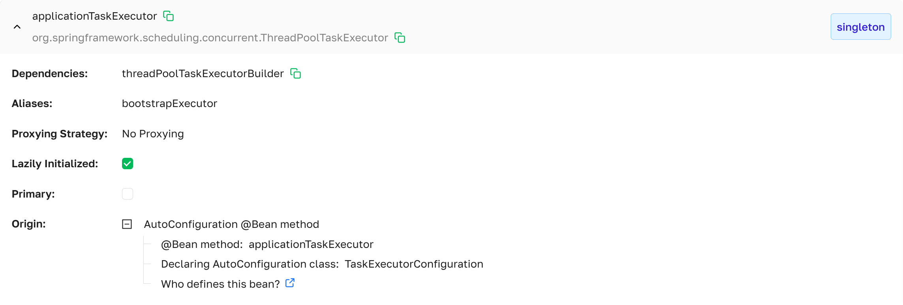

import Tabs from '@theme/Tabs';
import TabItem from '@theme/TabItem';

# Beans

The **Beans** page lists every Spring bean registered in the managed instance's `ApplicationContext`. Each row is an
expandable accordion that shows the bean's class, scope, dependencies, qualifiers, proxying strategy, and the origin
Spring used to create it.

 ***Beans page as presented in Axelix UI***

The page is read-only and available to every authenticated user — **VIEWER**, **EDITOR**, **ADMIN**, and **SUPER_ADMIN**
can all open it. See [Roles and
authorities](../setting-up-master-ui/authentication/authentication.mdx#roles-and-authorities) for the full
role/authority matrix.

A scrollable list of all beans, with a search input above the list and a counter in the form `<matching> / <total>`.

Each row header shows three things side by side:

- **Bean Name** — the bean identifier in the Spring context.
- **Class Name** — the fully qualified class (e.g. `org.springframework.scheduling.concurrent.ThreadPoolTaskExecutor`).
- **Scope** — an `Tag` on the right of the header, colour-coded per scope. Axelix maps the scope string Spring reports
  to one of these colours:
    - <span style={{color: '#1677ff', fontWeight: 'bold'}}>singleton</span>
    - <span style={{color: '#fa8c16', fontWeight: 'bold'}}>prototype</span>
    - <span style={{color: '#13c2c2', fontWeight: 'bold'}}>request</span>
    - <span style={{color: '#a0d911', fontWeight: 'bold'}}>session</span>
    - <span style={{color: '#faad14', fontWeight: 'bold'}}>application</span>
    - <span style={{color: '#722ed1', fontWeight: 'bold'}}>websocket</span>
    - <span style={{color: '#fa541c', fontWeight: 'bold'}}>refresh</span> (Spring Cloud)
    - <span style={{color: '#eb2f96', fontWeight: 'bold'}}>сustom scopes</span> (User custom scopes)

## Bean Details Dropdown

Expanding a row shows the bean's details. Sections appear only when they have data — e.g. a bean with no qualifiers
won't show a Qualifiers row.

 ***Bean dropdown page as presented in
Axelix UI***

- **Dependencies** — names of other beans this bean depends on. If a dependency is itself a registered bean, clicking
  its name jumps to that bean in the list.
- **Aliases** — alternative names registered for this bean, if any.
- **Qualifiers** — `@Qualifier` values applied to the bean, if any.
- **Proxying Strategy** — how Spring wrapped the bean instance. One of:
    - **CGLIB** — CGLIB subclass-based proxy.
    - **JDK Dynamic Proxy** — JDK interface-based proxy.
    - **No Proxying** — the bean is used as-is.
    - **Unknown** — Axelix could not determine the proxy type from the bean definition.
- **Lazily Initialized** — boolean. `true` for beans created on first use rather than at startup.
- **Primary** — boolean. `true` for beans annotated with `@Primary`.
- **Origin** — how Spring created the bean. See [Bean origin](#bean-origin) below.

### Bean origin

The Origin section either renders a single label or a small expandable tree, depending on which origin Spring reports
for the bean:

- **`@Component` or variants** — the bean came from `@Component` / `@Service` / `@Repository` / `@Controller` / custom
  stereotype. When the declaring class is tracked on the [Conditions](./conditions) page, the label switches to
  **`@AutoConfiguration class`** and becomes a link to that page.
- **`@Bean` method** — the bean came from a `@Bean` factory method. The tree shows:
    - **`@Bean` method** name.
    - **Declaring class** — the class that defines the `@Bean` method, clickable to jump to the bean whose class
      matches, when one is registered. The label switches to **Declaring AutoConfiguration class** when the declaring
      class is tracked on the [Conditions](./conditions) page.
    - **Who defines this bean?** link to the [Conditions](./conditions) page — shown for the same case, i.e. when the
      declaring class is tracked there.
    - **`@ConfigurationProperties` bean** link to the [Configuration Properties](./configuration-properties) page (only
      if the bean is annotated with `@ConfigurationProperties`).
- **Produced by the `FactoryBean`** — the bean was created by a `FactoryBean`. The tree shows the **Factory Bean** class
  name.
- **Synthetic bean** — Spring-internal bean (e.g. infrastructure objects registered by the framework or by libraries
  like Spring Data).
- **Unknown** — Spring did not report enough metadata to classify the origin. For beans registered programmatically via
  `BeanDefinitionRegistry`, this is the usual outcome. If such a bean is also annotated with `@ConfigurationProperties`,
  the Origin label switches to **`@ConfigurationProperties` bean** and links to the [Configuration
  Properties](./configuration-properties) page.

## MCP Tools

The bean catalog of a managed instance is also exposed to AI agents through MCP. See the [MCP Tools
catalog](../setting-up-master-ui/mcp/mcp-tools.mdx#instance-introspection).

## Properties

The page is backed by the `axelix-beans` actuator endpoint contributed by the Axelix Spring Boot Starter. Expose it
through the standard Spring Boot Actuator properties — see [Configuring Spring Boot
Starter](../setting-up-spring-boot-service/configuring-axelix-starter/configuring-axelix-starter.mdx) for the full list
of Axelix endpoints and surrounding setup:

<Tabs groupId="spring-config">
  <TabItem value="properties" label="application.properties">

```properties
management.endpoints.web.exposure.include=axelix-beans
```

  </TabItem>
  <TabItem value="yaml" label="application.yaml">

```yaml
management:
  endpoints:
    web:
      exposure:
        include:
          - axelix-beans
```

  </TabItem>
</Tabs>

## See also

- [Properties](./properties) — links to a bean here through **Injected in**.
- [Configuration Properties](./configuration-properties) — reached from the **`@ConfigurationProperties` bean** link in
  Origin.
- [Conditions](./conditions) — reached from the **`@AutoConfiguration class`** / **Who defines this bean?** links in
  Origin.
- [Configuring Master](../setting-up-master-ui/configuring-master/configuring-master.mdx)
- [Configuring Spring Boot
  Starter](../setting-up-spring-boot-service/configuring-axelix-starter/configuring-axelix-starter.mdx)
