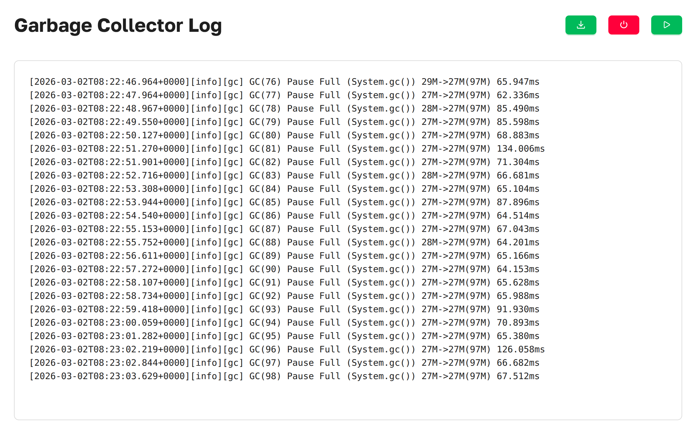

# Garbage Collector

We provide convenient access to `Garbage Collector` logs in the Spring Boot application.


***Garbage Collector as presented in Axelix UI***

In most cases, Garbage Collector logging is disabled by default. To view the logs, it must be enabled. 
The “Enable GC Logging” option allows you to do this.


---


## Garbage Collector Details{#details}
After enabling Garbage Collector logging, you can select the logging level:
- INFO
- WARNING
- TRACE
- DEBUG
- ERROR

After selecting the logging level, you can:
1. Trigger  
   the Garbage Collector to generate logs, or wait for logs to be produced during normal execution.
2. Download  
   the generated logs as a `.txt` file.
3. Disable  GC logging.

```
[2026-03-02T17:38:55.009+0000][info][gc] GC(428) Pause Full (System.gc()) 29M->28M(97M) 82.955ms
              │                  │    │    │               │               │    │   │       │
              │                  │    │    │               │               │    │   │       └─ GC pause duration
              │                  │    │    │               │               │    │   └─ Total heap
              │                  │    │    │               │               │    └─ After heap
              │                  │    │    │               │               └─ Before heap
              │                  │    │    │               └─ GC event description
              │                  │    │    └─ GC event ID
              │                  │    └─ Log tag (subsystem)
              │                  └─ Log level
              └─ Timestamp (ISO-8601 with timezone)
```