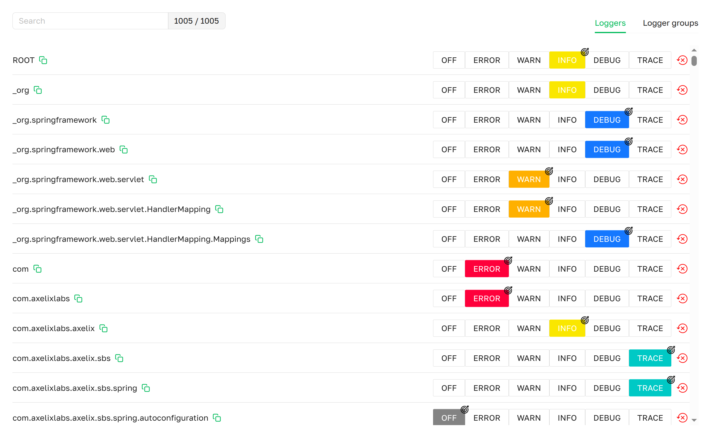
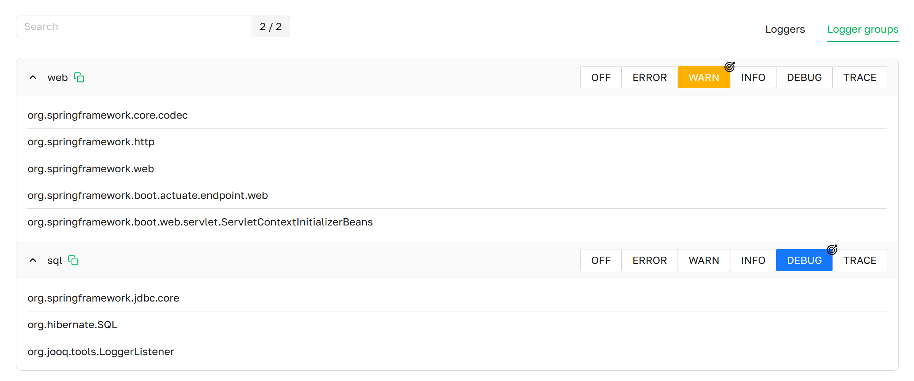

import Tabs from '@theme/Tabs';
import TabItem from '@theme/TabItem';
import {LoggersTable} from './LoggersTable';
import {LoggersTableReset} from './LoggersTableReset';
import {TargetThemeIcon} from './TargetThemeIcon';
import { INFO, DEBUG, WARN, TRACE } from './StatePaletteForLoggingLevel';

# Loggers

The **Loggers** page provides access to all configured logging mechanisms in a Spring Boot application, 
logger groups, and allows changing their logging levels.


***Loggers page as presented in Axelix UI***

The page is available to every authenticated user — **VIEWER**, **EDITOR**, **ADMIN**, and **SUPER_ADMIN** can all
open it, change levels, and reset levels. See
[Roles and authorities](../../setting-up-master-ui/authentication/authentication.mdx#roles-and-authorities) for the
full role/authority matrix.

## Loggers tab
A scrollable list displaying all active loggers in the application, with an indicator of their logging levels,
a search function for easy navigation, and a counter of active loggers in the form `<matching> / <total>`.

- **Name**:                 The name of the logger.
- **Logging level**:        The logger's current level. (See **Interactive Features**)
- **Reset**:                Resets the logging level to its initial value. (See **Interactive Features**)

## Logger groups tab

***Loggers group page as presented in Axelix UI***

A scrollable list displaying all logger groups, with an indicator of their logging levels,
a search function for groups and loggers for easy navigation, and a counter of groups.

- **Name**:                 The name of the logger group.
- **Logging group level**:  The current logging level of the logger group. If no level is highlighted by a color indicator, 
                            the loggers within the group have different logging levels. (See **Interactive Features**)

## Interactive Features

We provide the ability to change the logging level of an individual logger as well as a logger group.

### Loggers
For example, the logger com.nucleonforge.axelix.sbs has a logging level of <INFO /> (starting point).
To change its level, click on the desired level, for example <WARN />.
The logger will update, and the selected level will be marked with an icon <TargetThemeIcon />.
Note that when changing the logging level of `com.nucleonforge.axelix` from <INFO /> to <DEBUG /> (step 2),
it will also be marked with an icon <TargetThemeIcon />, and all loggers with the prefix `com.nucleonforge.axelix`
will change their level to <DEBUG /> (step 2). However, they will not be marked with an icon <TargetThemeIcon />,
because their level matches the parent logger `com.nucleonforge.axelix`.

<LoggersTable />

We also provide the ability to reset the logging level for a specific logger:
1. Initially, the `com.nucleonforge.axelix.sbs` logger had the <TRACE /> level (starting point).
2. It was then changed to the <INFO /> logging level (step 1).
3. Using the **Reset** button, you can restore the logger to its original <TRACE /> level (step 2).

<LoggersTableReset />

### Logger groups
- If the loggers in a group have different levels, the group has no color indicator on the level row.
- Changing the level of, for example, the `web` group to <WARN /> applies <WARN /> to every logger in that group.
- Resetting the level of a logger group is not supported — only individual loggers can be reset.

## MCP Tools

Reading the logger tree and changing levels at runtime — for a single logger, a logger group, or resetting an
individual logger — are also exposed to AI agents through MCP. See the
[MCP Tools catalog](../../setting-up-master-ui/mcp/mcp-tools.mdx#loggers).

## Properties

The page is backed by the `axelix-loggers` actuator endpoint contributed by the Axelix Spring Boot Starter. Expose it
through the standard Spring Boot Actuator properties — see
[Configuring Spring Boot Starter](../../setting-up-spring-boot-service/configuring-axelix-starter/configuring-axelix-starter.mdx)
for the full list of Axelix endpoints and surrounding setup:

<Tabs groupId="spring-config">
  <TabItem value="properties" label="application.properties">

```properties
management.endpoints.web.exposure.include=axelix-loggers
```

  </TabItem>
  <TabItem value="yaml" label="application.yaml">

```yaml
management:
  endpoints:
    web:
      exposure:
        include:
          - axelix-loggers
```

  </TabItem>
</Tabs>

## See also

- [Configuring Master](../../setting-up-master-ui/configuring-master/configuring-master.mdx)
- [Configuring Spring Boot Starter](../../setting-up-spring-boot-service/configuring-axelix-starter/configuring-axelix-starter.mdx)
