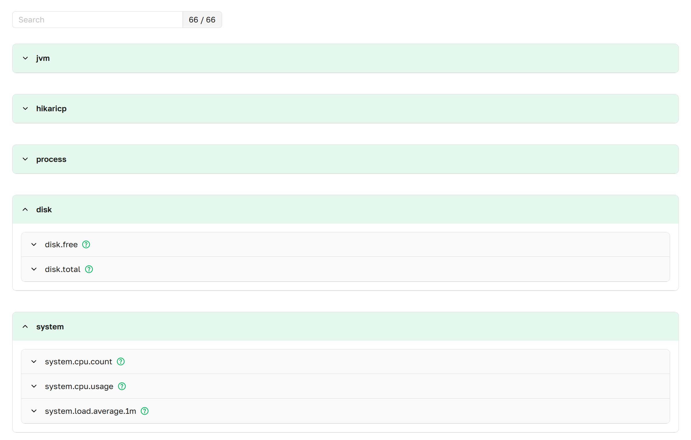
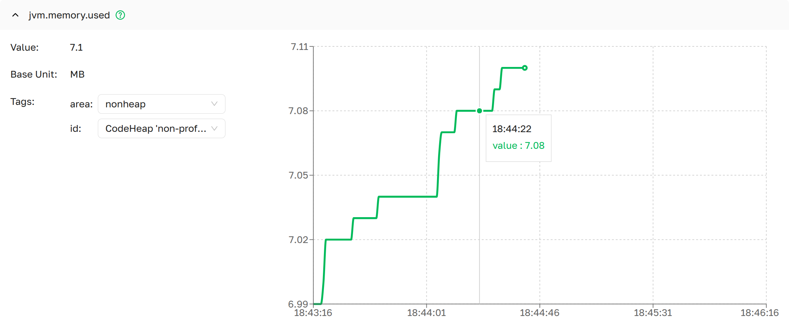

import Tabs from '@theme/Tabs';
import TabItem from '@theme/TabItem';

# Metrics

The Metrics page lists every Micrometer meter exposed by a managed Spring Boot instance, with a live chart and tag
filtering per metric.

Metrics are automatically grouped by their prefixes into expandable dropdown sections.
Each group represents a logical category of related metrics, such as JVM,
HTTP, or JDBC. This organization helps you quickly find and analyze metrics that belong
to the same functional area.


***Metrics as presented in Axelix UI***

The page is read-only and available to every authenticated user — **VIEWER**, **EDITOR**, **ADMIN**, and
**SUPER_ADMIN** can all open it. See
[Roles and authorities](../setting-up-master-ui/authentication/authentication.mdx#roles-and-authorities) for the full
role/authority matrix.

## Metric Details

The Metric Details page provides in-depth analysis of individual metrics with interactive charts, real-time values,
and intelligent tag filtering capabilities.


***JVM Memory Metric details as presented in Axelix UI***

## Page Layout

### Dropdown Header
- **Metric Name**: Full metric identifier (e.g., `jvm.memory.max`)
- **Description**: Hover your cursor over the icon 
  to see what this metric measures.

### Left Panel: Current Metric Information
Displays real-time information about the selected metric:
- **Value**: Latest measurement
- **Base Unit**: Measurement unit (bytes, milliseconds, percentage, scalar quantity etc.)
- **Tags**: Dropdown selectors for filtering measurements by tag dimensions. Only combinations that actually exist on the instance are offered; invalid combinations are kept visible but disabled.

### Right Panel: Time Series Chart
Line chart of the metric value over a sliding time window. The page polls the instance periodically and resets the
window once it elapses, so the chart reflects recent behaviour rather than the full history since the instance started.

## Tag Filtering (Drilling Down)

The list of valid tag combinations comes from the instance's Micrometer `MeterRegistry` — Axelix does not invent or
constrain them. When you pick a value in one dropdown, the others update to show only the still-valid options; invalid
ones stay visible but disabled, with the tooltip *"This tag value is not valid, considering the values selected for
other tags"*. See the Spring Boot reference for the underlying mechanic:
[Drilling Down](https://docs.spring.io/spring-boot/api/rest/actuator/metrics.html).

### How It Works
When you select a tag value, the available options for the remaining tags are filtered down to the combinations that
actually exist on the running instance.

### Example: JVM Memory Metrics
For metric `jvm.memory.used` with tags `area` and `id`:

| `area`  | `id`                              | Offered |
|---------|-----------------------------------|---------|
| heap    | G1 Eden Space                     | ✅      |
| heap    | G1 Survivor Space                 | ✅      |
| heap    | G1 Old Gen                        | ✅      |
| nonheap | Metaspace                         | ✅      |
| nonheap | Compressed Class Space            | ✅      |
| nonheap | CodeHeap profiled nmethods        | ✅      |
| nonheap | CodeHeap non-nmethods             | ✅      |
| nonheap | CodeHeap nonprofiled-nmethods     | ✅      |
| heap    | Metaspace                         | ❌      |
| nonheap | G1 Old Gen                        | ❌      |

## Properties

The page is backed by the `axelix-metrics` actuator endpoint contributed by the Axelix Spring Boot Starter. Expose it
through the standard Spring Boot Actuator properties — see
[Configuring Spring Boot Starter](../setting-up-spring-boot-service/configuring-axelix-starter/configuring-axelix-starter.mdx)
for the full list of Axelix endpoints and surrounding setup:

<Tabs groupId="spring-config">
  <TabItem value="properties" label="application.properties">

```properties
management.endpoints.web.exposure.include=axelix-metrics
```

  </TabItem>
  <TabItem value="yaml" label="application.yaml">

```yaml
management:
  endpoints:
    web:
      exposure:
        include:
          - axelix-metrics
```

  </TabItem>
</Tabs>

## See also

- [Configuring Master](../setting-up-master-ui/configuring-master/configuring-master.mdx)
- [Configuring Spring Boot Starter](../setting-up-spring-boot-service/configuring-axelix-starter/configuring-axelix-starter.mdx)