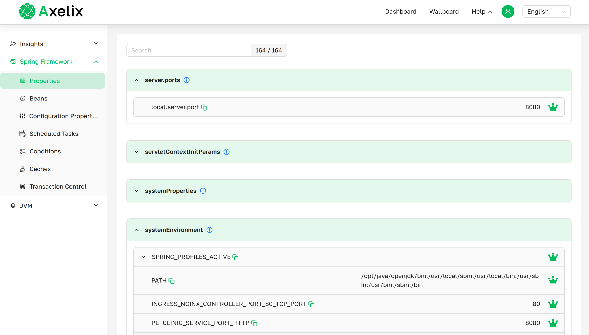
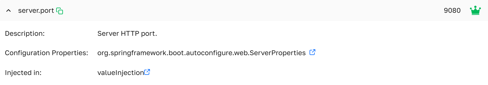

# Properties
The Properties page provides complete visibility into all configuration properties and their sources within 
Spring Boot application. It shows the current values, where each value came from and the priority hierarchy 
of property sources.

***Properties as presented in Axelix UI***

A scrollable list of all active properties in the application, grouped by their source. It uses expandable 
sections (expanded by default), provides search functionality for easier navigation, and displays a counter 
of active properties.

- **Source Name**:     The sourceName of the property source.
- **Description**:     Hover your cursor over the icon 
                       to see the custom description of this property source.
- **Properties**:      The list of property entries.

---

## Properties Details{#details}

***Properties as presented in Axelix UI***

The dropdown displays the following information:
- **Name**:                  The property name.
- **Deprecation**:           If a property is deprecated, its background color is displayed in red. 
- **Value**:                 The value assigned to this property.
- **isPrimary**:             Whether this property value is primary (i.e. this value takes precedence over the other values 
                             from other property sources). 
- **ConfigPropsBeanName**:   The propertyName of the configProps (if any) bean onto which this property maps. 
                             Find a dependency marked with  icon.
- **Description**:           The description from spring-configuration-metadata.json.
- **InjectionPoints** :      The injection points where this property is used. 
                             Find a dependency marked with  icon.

:::info
By default, the property value is hidden as `*****`. To enable value visibility,
you must add the property `management.endpoint.env.show-values` with the value `always`
to the Application properties files.
:::