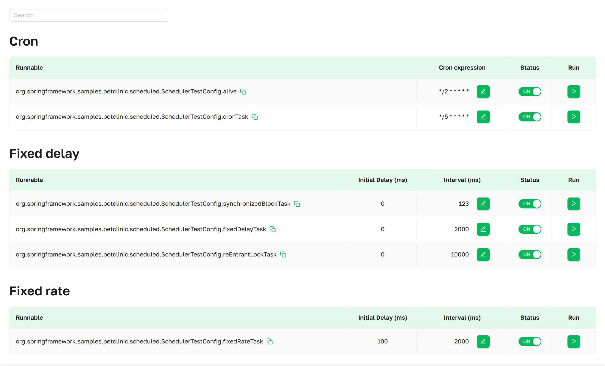

import Tabs from '@theme/Tabs';
import TabItem from '@theme/TabItem';

# Scheduled Tasks
The “Scheduled Tasks” page provides access to all tasks annotated with `@Scheduled` within a Spring Boot application.
You can also update the task status, modify its schedule, and trigger it manually when required.

 ***Scheduled Tasks
as presented in Axelix UI***

A scrollable list displaying all configured `Scheduled Tasks` in the application, grouped by property types: **fixed
delay**, **fixed rate** and **cron**, with a search function for scheduled tasks to enable easy navigation.

## Scheduled Tasks Details

### Cron
 ***Scheduled
Tasks as presented in Axelix UI***

*A scheduled task with an exact execution configuration.*
- **Runnable**:                 The *target* that will be executed.
- **Cron expression**:          The cron expression (e.g., "0 1 1 5 7 3" or "0 0/15 9-17 ? * MON,WED,FRI" (seconds
  minutes hours day_of_month month day_of_week)) (See **Interactive Features**)
- **Status**:                   Shows the target state and provides the ability to enable  or disable  the target. (See
  **Interactive Features**)
- **Run**:                      Forces immediate execution of the task. (See **Interactive Features**)

### Fixed delay
 ***Scheduled Tasks as
presented in Axelix UI***

*Schedules Tasks with the interval between completing tasks, counted from the end of the previous task.*
- **Runnable**:                 The *target* that will be executed.
- **Initial Delay (ms)**:       The delay, in milliseconds, before first execution.
- **Interval (ms)**:            The interval, in milliseconds, between the start of each execution. (See **Interactive
  Features**)
- **Status**:                   Shows the target state and provides the ability to enable  or disable  the target. (See
  **Interactive Features**)
- **Run**:                      Forces immediate execution of the task. (See **Interactive Features**)

### Fixed rate
 ***Scheduled Tasks as
presented in Axelix UI***

*Schedules Tasks with the interval between completing tasks, counted from the start of the previous task.*
- **Runnable**:                 The *target* that will be executed.
- **Initial Delay (ms)**:       The delay, in milliseconds, before first execution.
- **Interval (ms)**:            The interval, in milliseconds, between the start of each execution. (See **Interactive
  Features**)
- **Status**:                   Shows the target state and provides the ability to enable  or disable  the target. (See
  **Interactive Features**)
- **Run**:                      Forces immediate execution of the task. (See **Interactive Features**)

## Interactive Features

The actions below — running a task on demand, modifying its schedule, and toggling its status — require the
`SCHEDULED_TASKS_MODIFY` authority, granted by the built-in **EDITOR**, **ADMIN**, and **SUPER_ADMIN** roles. Users
without this authority see the same controls but cannot interact with them.

When a control button is visible but your account lacks this authority, Axelix keeps it disabled and shows a tooltip with the
corresponding message on hover.

### Run
We provide the ability to trigger a task manually without affecting its schedule. To do so, simply click , and the task will be executed
immediately.

### Interval/Cron expression
You have a convenient way to modify the interval and cron expression of a scheduled task in real time.
1. Click  next to the
   schedule you want to modify.
2. An interactive dialog will open, allowing you to make changes. When you edit a cron expression, the dialog shows a
   live **Valid** / **Invalid** indicator next to the input — it updates on every keystroke against the same validator
   the backend uses, and the save action stays disabled until the expression is valid. After making changes, click the
    to cancel the change, or the
    to confirm the action.
3. Once confirmed, the task will follow the new schedule.

### Status
We provide the ability to manage the target state. The initial state of each target is (on) , meaning the task is executed
according to the configured schedule. When the **Status** is switched to (off) , a target that is currently
executing its scheduled work continues until completion and then ignores the schedule. To return the target to its
initial state, in which the task follows the scheduled execution, it is necessary to switch the **Status** back to (on)
.

## MCP Tools

Scheduled tasks can also be inspected by an AI agent through MCP — see the [MCP Tools
catalog](../setting-up-master-ui/mcp/mcp-tools.mdx#instance-introspection).

## Properties

The page is backed by the `axelix-scheduled-tasks` actuator endpoint contributed by the Axelix Spring Boot Starter.
Expose it through the standard Spring Boot Actuator properties — see [Configuring Spring Boot
Starter](../setting-up-spring-boot-service/configuring-axelix-starter/configuring-axelix-starter.mdx) for the full list
of Axelix endpoints and surrounding setup:

<Tabs groupId="spring-config">
  <TabItem value="properties" label="application.properties">

```properties
management.endpoints.web.exposure.include=axelix-scheduled-tasks
```

  </TabItem>
  <TabItem value="yaml" label="application.yaml">

```yaml
management:
  endpoints:
    web:
      exposure:
        include:
          - axelix-scheduled-tasks
```

  </TabItem>
</Tabs>

## See also

- [Configuring Master](../setting-up-master-ui/configuring-master/configuring-master.mdx)
- [Configuring Spring Boot
  Starter](../setting-up-spring-boot-service/configuring-axelix-starter/configuring-axelix-starter.mdx)