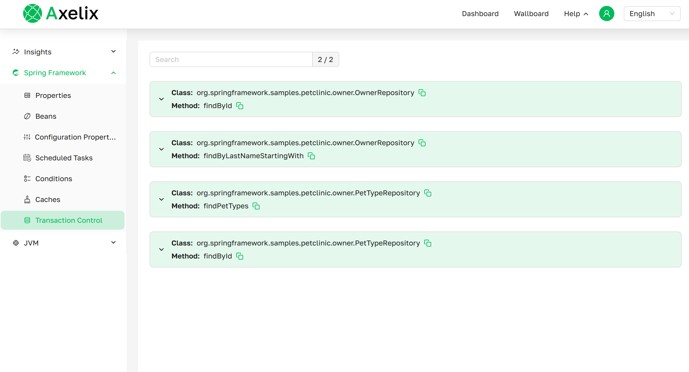
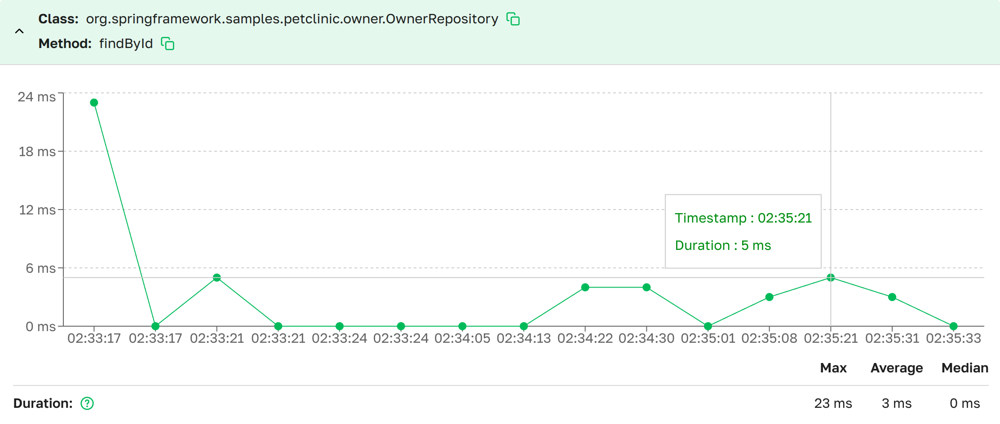

# Transaction Control

The `Transaction Control` page provides access to metrics describing transaction duration in the Spring Boot application.

***Transaction Control as presented in Axelix UI***

A scrollable list of all active transactions in the application, organized into dropdown sections with detailed 
information. It includes search functionality for easier navigation and a counter of active transactions.

- **Class**:   The short name of the class where transaction is initiated.
- **Method**:  The name of the method where transaction is initiated.

---

## Transaction Control Details {#details}

***Transaction Details as presented in Axelix UI***

Detailed Transaction Information:
- **Timestamp**:   Transaction started
- **Duration**:    Transaction execution duration in milliseconds

Overall Transaction Statistics:
- **Max**:         Maximum execution duration in milliseconds
- **Average**:     Average execution duration in milliseconds
- **Median**:      Median execution duration in milliseconds