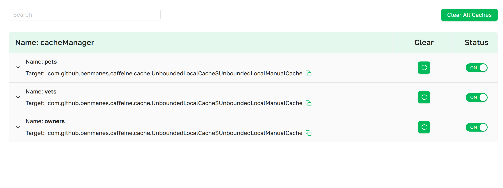
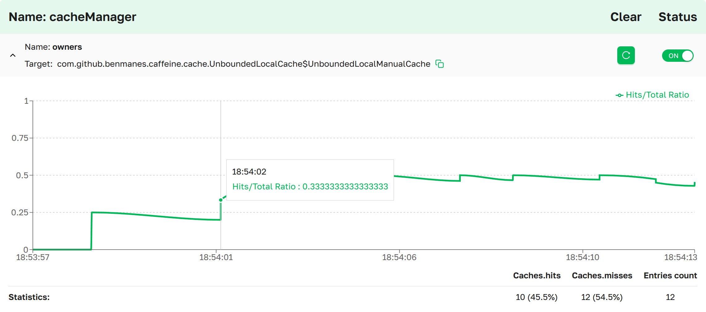

import Tabs from '@theme/Tabs';
import TabItem from '@theme/TabItem';

# Кэши

На странице **Кэши** представлены все настроенные кэши управляемого сервиса на Spring Boot. На ней отображается
диаграмма соотношения попаданий и общего количества попаданий в каждый кэш, количество попаданий и промахов, примерное
количество записей, есть возможность управлять статусом и очищать отдельные кэши или все кэши сразу.

 ***Страница «Кэши» в интерфейсе
Axelix***

Страница доступна любому аутентифицированному пользователю — `VIEWER`, `EDITOR`, `ADMIN` и `SUPER_ADMIN` могут её
открыть и изучить статистику кэшей. Деструктивные действия закрыты отдельными полномочиями:

- **Очистить** кэш и **Очистить все кэши** требуют полномочия `CACHES_CLEAR`.
- Переключатель **Статус** (включить / выключить кэш) требует полномочия `CACHES_TOGGLE`.

Оба полномочия выдаются встроенными ролями `EDITOR`, `ADMIN` и `SUPER_ADMIN`. `VIEWER` видит элементы управления, но не
может с ними взаимодействовать. Полную матрицу ролей и полномочий см. в разделе [Роли и
полномочия](../setting-up-master-ui/authentication/authentication.mdx#roles-and-authorities).

Прокручиваемый список всех настроенных кэшей в сервисе, сгруппированных по соответствующим менеджерам кэшей.
- **Поиск**:               поле ввода, фильтрующее список по имени кэша или имени менеджера кэшей. (См. **Интерактивные
  возможности**)
- **Очистить все кэши**:   кнопка, очищающая все кэши. (См. **Интерактивные возможности**)
- **Имя**:                 имя менеджера кэшей.

В каждой строке кэша также показано:
- **Имя**:          имя кэша.
- **Реализация**:   полностью квалифицированное имя нативной реализации кэша с элементом копирования в буфер обмена.
- **Очистить**:     кнопка для очистки конкретного кэша. (См. **Интерактивные возможности**)
- **Статус**:       переключатель, включающий или выключающий кэш во время работы. (См. **Интерактивные возможности**)

Кэши, для которых доступна статистика обращений, можно раскрыть, открыв раздел **Подробности кэша**. Кэши, которые не
сообщают статистику обращений, также присутствуют в списке, но раскрыть их нельзя.

## Подробности кэша
 ***Страница подробностей
кэша в интерфейсе Axelix***

В разделе подробностей расположен линейный график **Соотношение попаданий/всего** — доля попаданий в скользящем окне по
записанной истории обращений. Ось Y всегда `0..1`. Ось X — это временная метка обращения; её шаг автоматически
выбирается по отображаемому диапазону (секунды, минуты, часы, дни или месяцы).

При наведении на график показывается соотношение в соответствующей временной точке.

Под графиком строка **Статистика** обобщает записанные обращения:
- **Попадания**:           общее количество попаданий в кэш с долей попаданий относительно всех записанных обращений.
- **Промахи**:             общее количество промахов кэша с долей промахов относительно всех записанных обращений.
- **Количество записей**:  оценочное число записей в нативном кэше. Показывается только тогда, когда кэш сообщает свой
  размер — на данный момент это поддерживается для `Cache` из Caffeine и кэшей на основе `ConcurrentHashMap` (например,
  `ConcurrentMapCache`).

## **Интерактивные возможности**

### Поиск
Введите текст в поле поиска над списком, чтобы отфильтровать отображаемые менеджеры кэшей. Менеджер кэшей показывается,
если введённый текст содержится в его имени или в имени любого принадлежащего ему кэша (без учёта регистра).

### Очистить все кэши
Мы предоставляем удобный способ очистить все кэши в сервисе. Для этого нажмите 

### Очистить кэш
Чтобы очистить отдельный кэш, нажмите  рядом с нужным кэшем.

### Статус
Мы предоставляем возможность управлять состоянием конкретного кэша. Исходное состояние каждого кэша — (включено) , то есть кэш работает. Чтобы
выключить его, переключите **Статус** на (выключено) .

## MCP-инструменты

Кэши также может инспектировать и очищать ИИ-агент через MCP — см. [Каталог
MCP-инструментов](../setting-up-master-ui/mcp/mcp-tools.mdx#caches).

## Свойства

Страница работает поверх actuator-эндпоинта `axelix-caches`, который добавляет Axelix Spring Boot Starter. Она доступна
через стандартные свойства Spring Boot Actuator. Полный список конечных точек Axelix и сопутствующих настроек см. в
разделе [Настройка Spring Boot
Starter](../setting-up-spring-boot-service/configuring-axelix-starter/configuring-axelix-starter.mdx):

<Tabs groupId="spring-config">
  <TabItem value="properties" label="application.properties">

```properties
management.endpoints.web.exposure.include=axelix-caches
```

  </TabItem>
  <TabItem value="yaml" label="application.yaml">

```yaml
management:
  endpoints:
    web:
      exposure:
        include:
          - axelix-caches
```

  </TabItem>
</Tabs>

## См. также

- [Настройка Master](../setting-up-master-ui/configuring-master/configuring-master.mdx)
- [Настройка Spring Boot
  Starter](../setting-up-spring-boot-service/configuring-axelix-starter/configuring-axelix-starter.mdx)
