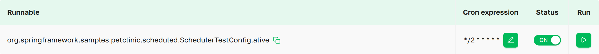
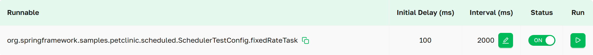
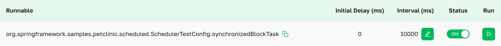

import Tabs from '@theme/Tabs';
import TabItem from '@theme/TabItem';

# Запланированные задачи
На странице **Запланированные задачи** можно получить доступ ко всем задачам, помеченным `@Scheduled` в сервисе Spring
Boot. Вы также можете изменить статус задачи, ее расписание и при необходимости запустить ее вручную.

 ***Запланированные задачи в
интерфейсе Axelix***

Прокручиваемый список, в котором отображаются все настроенные Scheduled Tasks в сервисе задачи, сгруппированные по типам
свойств: фиксированная задержка, фиксированная частота и cron, с функцией поиска запланированных задач для удобства
навигации.

## Подробности запланированных задач

### Cron

***Запланированные задачи в интерфейсе Axelix***

*Запланированная задача с точной конфигурацией выполнения.*
- **Метод**:                    *цель*, которая будет выполнена.
- **Cron выражение**:           cron-выражение (например, "0 1 1 5 7 3" или "0 0/15 9-17 ? * MON,WED,FRI" (секунды
  минуты часы день_месяца месяц день_недели)) (См. **Интерактивные возможности**)
- **Статус**:                   показывает состояние цели и даёт возможность включить  или выключить  цель. (См. **Интерактивные
  возможности**)
- **Запуск**:                   принудительно запускает задачу немедленно. (См. **Интерактивные возможности**)

### Fixed delay

***Запланированные задачи в интерфейсе Axelix***

*Планирует задачи с интервалом между завершениями, отсчитываемым от конца предыдущей задачи.*
- **Метод**:                    *цель*, которая будет выполнена.
- **Начальная задержка (мс)**:  задержка в миллисекундах перед первым выполнением.
- **Интервал (мс)**:            интервал в миллисекундах между началом каждого выполнения. (См. **Интерактивные
  возможности**)
- **Статус**:                   показывает состояние цели и даёт возможность включить  или выключить  цель. (См. **Интерактивные
  возможности**)
- **Запуск**:                   принудительно запускает задачу немедленно. (См. **Интерактивные возможности**)

### Fixed rate

***Запланированные задачи в интерфейсе Axelix***

*Планирует задачи с интервалом, отсчитываемым от начала предыдущей задачи.*
- **Метод**:                    *цель*, которая будет выполнена.
- **Начальная задержка (мс)**:  задержка в миллисекундах перед первым выполнением.
- **Интервал (мс)**:            интервал в миллисекундах между началом каждого выполнения. (См. **Интерактивные
  возможности**)
- **Статус**:                   показывает состояние цели и даёт возможность включить  или выключить  таргет. (См.
  **Интерактивные возможности**)
- **Запуск**:                   принудительно запускает задачу немедленно. (См. **Интерактивные возможности**)

## Интерактивные возможности

Для выполнения следующих действий — запуска задачи по требованию, изменения ее расписания и переключения ее статуса —
требуются права `SCHEDULED_TASKS_MODIFY` пользователя, предоставляемые встроенными ролями `EDITOR`, `ADMIN` и
`SUPER_ADMIN`. Пользователи без этих прав видят те же элементы управления, но не могут с ними взаимодействовать.

Когда элемент управления виден, но у вашей учётной записи нет этого полномочия, Axelix оставляет его неактивным и по
наведению показывает подсказку с соответствующим сообщением.

### Запуск
Мы предоставляем возможность запустить задачу вручную, не затрагивая её расписание. Для этого просто нажмите , и задача будет выполнена немедленно.

### Интервал / Cron выражение
У вас есть удобный способ изменять интервал и cron-выражение запланированной задачи в реальном времени.
1. Нажмите  рядом с
   расписанием, которое хотите изменить.
2. Откроется интерактивный диалог, позволяющий внести изменения. Когда вы редактируете cron-выражение, диалог показывает
   живой индикатор **Valid** / **Invalid** рядом с полем ввода — он обновляется на каждое нажатие клавиши и работает на
   том же валидаторе, что и бэкенд, а действие сохранения остаётся отключённым, пока выражение не станет валидным. После
   внесения изменений нажмите ,
   чтобы отменить изменение, или ,
   чтобы подтвердить действие.
3. После подтверждения задача будет следовать новому расписанию.

### Статус
Мы предоставляем возможность управлять целевым состоянием. Исходное состояние каждой цели — (включено) , то есть задача выполняется в
соответствии с настроенным расписанием. Когда **статус** переключается на (выключено) , цель, которая в данный
момент выполняет запланированную работу, продолжает работать до завершения, а затем игнорирует расписание. Чтобы вернуть
цель в исходное состояние, при котором задача выполняется в соответствии с расписанием, необходимо снова переключить
**статус** на (включено) .

## MCP-инструменты

Запланированные задачи также может инспектировать ИИ-агент через MCP — см. [Каталог
MCP-инструментов](../setting-up-master-ui/mcp/mcp-tools.mdx#instance-introspection).

## Свойства

Страница работает поверх actuator-эндпоинта `axelix-scheduled-tasks`, который добавляет Axelix Spring Boot Starter. Она
доступна через стандартные свойства Spring Boot Actuator. Полный список конечных точек Axelix и сопутствующих настроек
см. в разделе [Настройка Spring Boot
Starter](../setting-up-spring-boot-service/configuring-axelix-starter/configuring-axelix-starter.mdx):

<Tabs groupId="spring-config">
  <TabItem value="properties" label="application.properties">

```properties
management.endpoints.web.exposure.include=axelix-scheduled-tasks
```

  </TabItem>
  <TabItem value="yaml" label="application.yaml">

```yaml
management:
  endpoints:
    web:
      exposure:
        include:
          - axelix-scheduled-tasks
```

  </TabItem>
</Tabs>

## См. также

- [Настройка Master](../setting-up-master-ui/configuring-master/configuring-master.mdx)
- [Настройка Spring Boot
  Starter](../setting-up-spring-boot-service/configuring-axelix-starter/configuring-axelix-starter.mdx)
