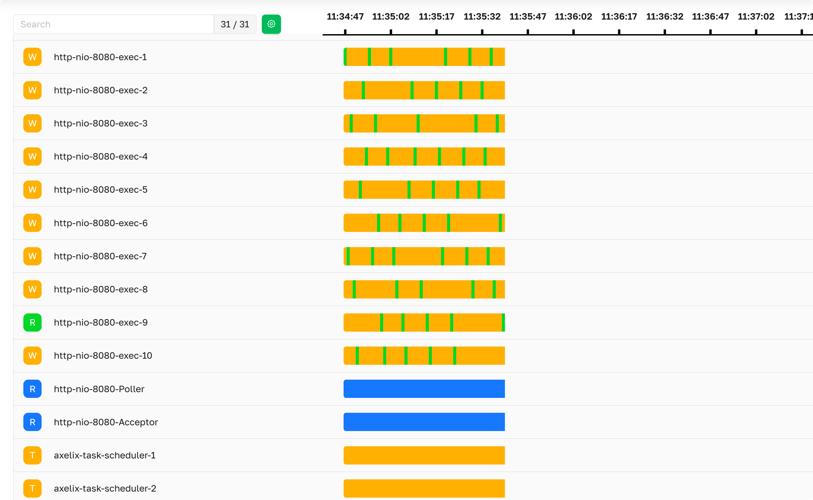
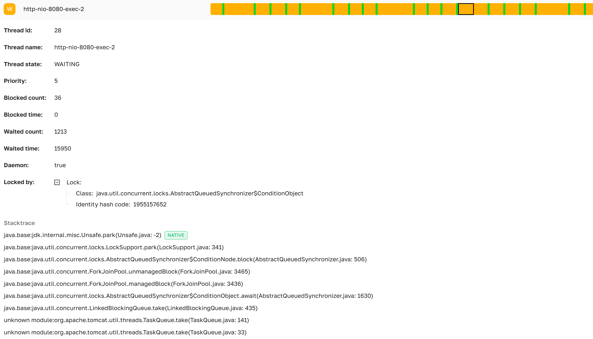

import Tabs from '@theme/Tabs';
import TabItem from '@theme/TabItem';

# Дамп потоков

На странице **Дамп потоков** в режиме реального времени отображается состояние каждого потока в управляемом сервисе на
Spring Boot. Страница периодически опрашивает сервис, поэтому список, состояния потоков и временная шкала отражают
текущее состояние JVM, а не зафиксированное в определённый момент.

 ***Страница
«Дамп потоков» в интерфейсе Axelix***

Страница доступна любому аутентифицированному пользователю — `VIEWER`, `EDITOR`, `ADMIN` и `SUPER_ADMIN` могут её
открыть и переключать **Мониторинг конфликтов между потоками**. Полную матрицу ролей и полномочий см. в разделе [Роли и
полномочия](../setting-up-master-ui/authentication/authentication.mdx#roles-and-authorities).

В верхней части страницы расположены три элемента управления:

- Поле **поиска**, фильтрующее список потоков по имени, счётчик рядом показывает `<соответствует> / <всего>`.
- Кнопка **Настройки** ,
  открывающая модальное окно с переключателем **Мониторинг конфликтов между потоками** (см. [Настройки](#настройки)
  ниже).
- Скользящая лента **шкалы времени**, на которой выбирается момент для изучения — выбор диапазона определяет, что
  показано в подробностях по каждому потоку ниже.

Потоки отсортированы по приоритету JVM и отображаются как аккордеоны. В заголовке каждого аккордеона показаны имя
потока, его текущее состояние и цветовой индикатор состояния (см. [Цвета состояний потоков](#цвета-состояний-потоков)
ниже).

## Подробности дампа потоков


***Страница подробностей дампа потоков в интерфейсе Axelix***

Раскройте поток, чтобы увидеть его подробный снимок за временной диапазон, выбранный на шкале:

- **Идентификатор потока**:     идентификатор потока, выданный JVM.
- **Имя потока**:               имя потока.
- **Состояние потока**:         состояние потока JVM (`RUNNABLE`, `BLOCKED`, `WAITING`, `TIMED_WAITING`,
  `TERMINATED`,…).
- **Приоритет**:                приоритет потока JVM.
- **Счётчик блокировок**:       сколько всего раз поток был заблокирован. Заполняется, только пока включён **Мониторинг
  конфликтов между потоками** — иначе показывается *Не Доступно*.
- **Общее время блокировки**:   время, которое поток провёл в заблокированном состоянии, в миллисекундах. Заполняется,
  только пока включён **Мониторинг конфликтов между потоками** — иначе показывается *Не Доступно*.
- **Счётчик ожиданий**:         сколько всего раз поток ожидал уведомления. Заполняется, только пока включён
  **Мониторинг конфликтов между потоками** — иначе показывается *Не Доступно*.
- **Общее время ожидания**:     время, которое поток провёл в ожидании, в миллисекундах. Заполняется, только пока
  включён **Мониторинг конфликтов между потоками** — иначе показывается *Не Доступно*.
- **Демон**:                    является ли поток демоном.
- **Удерживается блокировкой**: информация об объекте блокировки, которого ждёт поток, если применимо:
    - **Класс**:                полностью квалифицированное имя класса объекта блокировки.
    - **Хеш-код объекта блокировки**: хэш-код идентификатора объекта блокировки.
- **Стек вызовов**:             стек вызовов, захваченный в выбранный момент.

### Цвета состояний потоков

| Индикатор                                                                                   | Состояние           |
|:-------------------------------------------------------------------------------------------:|---------------------|
|         | RUNNABLE            |
|          | RUNNABLE (native)   |
|        | WAITING             |
|        | WAITING (suspended) |
|  | TIMED_WAITING       |
|                      | BLOCKED             |
|       | TERMINATED          |
|          | other               |


## Настройки

Нажатие на  открывает
модальное окно с одним переключателем:

- **Мониторинг конфликтов между потоками** — включает JMX-мониторинг конфликтов между потоками на `ThreadMXBean`
  сервиса. Когда он включён, JVM отслеживает, сколько времени каждый поток провёл в состояниях **BLOCKED** и
  **WAITING**, и это заполняет поля `Счётчик блокировок` / `Общее время блокировки` / `Счётчик ожиданий` / `Общее время
  ожидания` выше. Когда он выключен, эти четыре поля остаются *Не Доступно*.

Учтите, что мониторинг конфликтов даёт заметные накладные расходы для JVM, поэтому продакшен-сервисы обычно оставляют
его выключенным и включают только во время прицельного расследования.

## Свойства

Страница работает поверх actuator-эндпоинта `axelix-thread-dump`, который добавляет Axelix Spring Boot Starter. Она
доступна через стандартные свойства Spring Boot Actuator. Полный список конечных точек Axelix и сопутствующих настроек
см. в разделе [Настройка Spring Boot
Starter](../setting-up-spring-boot-service/configuring-axelix-starter/configuring-axelix-starter.mdx):

<Tabs groupId="spring-config">
  <TabItem value="properties" label="application.properties">

```properties
management.endpoints.web.exposure.include=axelix-thread-dump
```

  </TabItem>
  <TabItem value="yaml" label="application.yaml">

```yaml
management:
  endpoints:
    web:
      exposure:
        include:
          - axelix-thread-dump
```

  </TabItem>
</Tabs>

## См. также

- [Настройка Master](../setting-up-master-ui/configuring-master/configuring-master.mdx)
- [Настройка Spring Boot
  Starter](../setting-up-spring-boot-service/configuring-axelix-starter/configuring-axelix-starter.mdx)
